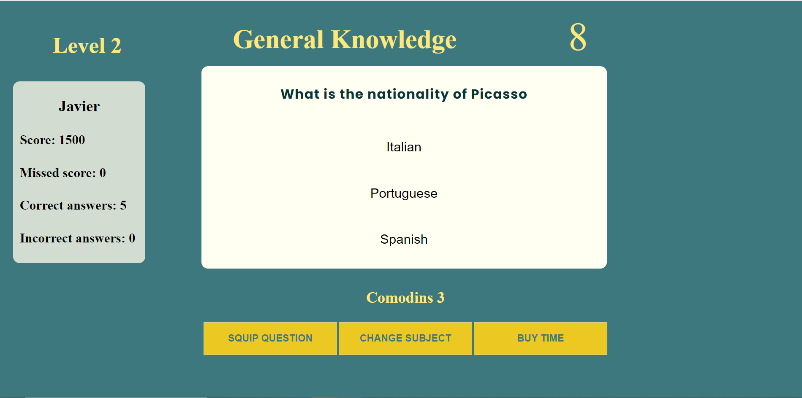

The Trivial Quizz-Quizz game is designed to entertaint people by answering questions of diferents subjects to challenge themselves while adquiring knowledge. It is an amusing way to get a bit of culture while having fun.
The application jumps into harder levels of questions as the user advance.

# Table Contents

  - Planning stage
    - Target Audiences
    - User stories
    - Design goals
    - Design choises
    - Font
    - Color scheme

    - Wireframes

  - Features
    - Difficulty
    - Comodins

  - Future features
  - Testing
    - Responsiveness
    - Lighthouse
      - Desktop
      - Mobile
    - Validators

  - Bugs
    - Fixed bugs
    - Known bugs
  - Technology Used
    - Languajes
    - Libraries

  - Deployment
  - Credits
    - Content
    - Media
    - Thanks

## Planning Stage

  ### Target Audience

  Anyone who wants to kill some time while challenging themselves on how much they know and adquire knowledge at a time.

  ### User stories

   - As a user i want the site to be intuitive
   - As a user i want the site to be beautyfull and readeble
   - As a user i want to challenge myself
   - As a user i want the game to get harder and harder
   - As a user i want to beat my previous score

   ### Design goals

   - A simple and minimalistic site for all devices
   - Easy to use
   - To be challenging enough for users to play again

  ### Design Choices

  #### Font

  I don't have much of a knowledge about fonts, so i just went for a funny one for the welcome heading, 'Alegreya' serif, and a san serif one for the game text, Poppins sans-serif. For the subject names and count downs i just left the default font that gives to  the subject names seriusness.

  #### Color scheme

  The main color conveys reassurance combined to a very light yellow on the questions panel.
  In order to make good contrast on the welcome text i used a yellow color, an orange and a lighter orange for headings:

   - Background: rgb(60, 120, 125)
   - Questions panel: rgb(255, 255, 242)
   - Headings:
       - orange: orange
       - lighter orange: rgb(255, 204, 106)
  - Background buttons: rgba(255, 208, 24, 0.9)

  ### Wireframes
  I drew the initial ideal into a paper to wireframe the project, i prefer user pen and paper as it is faster, but i didn't keep the drafts this time. The final proyect desing is very close to the initial one.

  ##Features

  ### Difficulty

   - There are 2 difficulties that go from the easiest to the hardest as the user advance on the game.
    After 5 correct answers it automatically jumps into the 2nd level of questions about the same prior subject.

  
  

  ## Comodins

   - The game provides of 3 comodins to the user in order to help them to go to next question on the most difficult ones for them.
   
   

        - Skip question:
        The game will jump into the next question.
        This comodin will desapear after using.

        - Change subject:
        The user has the change of change subject question on the flow.
        This comodin will desapear after using.
           - Design destop: .
           - Design mobile: 

        - Buy extra time:
        The counter will add 20s in order for the user to have time to research the question and thereby answer correctly.
        This comodin will desapear after using.
