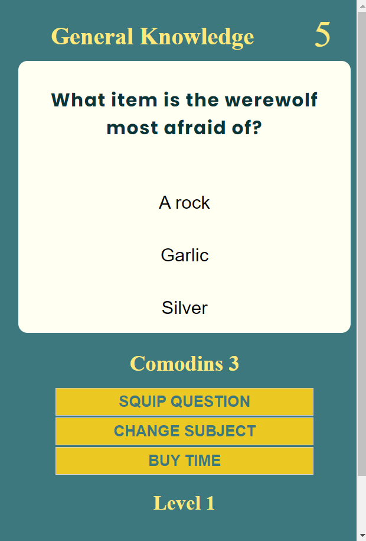

## About

  The Trivial Quizz-Quizz game is designed to entertaint users by answering questions about differents subjects to challenge themselves while adquiring knowledge. It is an amusing way to get a bit of a culture while having fun.
  The application jumps into harder levels of questions as the user advance.

## What you must know

   Currently the game contains few data which results in a short number of questions available, therefore the game is designed to finish after 14 correct answers and the user will face repeated questions in every attempt.

## How to play

-   The user must enter a player name and select a subject to start, which will initiate a countdown from 3, only then the first question will be displayed.
-   The user will have 10 seconds to answer, after that time if there is no answer the game will be over displaying the final game panel with the player score.
-   If the user answer correctly 5 questions, the user will jump into  the next level 2 and will face harder questions to answer.
-   The user will have 3 comodins to use:
    -   Squip question: will jump to the next question automatically.
    -   Change subject: the user will be able to change the subject to skip the question at that time question.
    -   Buy time: the user will see 20secomds added to the countdown.
-   If the user answers incorrectly one of the questions the game will be game over.
-   The user is able to restart the game without exiting the website

-   Play game [Quizz-Quizz](https://javierbl89.github.io/QUIZZ-QUIZZ-Game-Code-Institute-Project-2/)

    # Table Contents

    ### [Planning stage](#planning-stage)

    -   Target Audiences
    -   User stories
    -   Design goals
    -   Design choises
    -   Font
    -   Color scheme
    -   Wireframes

        ### [Features](#features)

    -   Difficulty
    -   Comodins

        ### [Future features](#future-features)

        ### [Testing](#testing)

    -   Responsiveness
    -   Lighthouse
        -   Desktop
        -   Mobile
    -   Validators

        ### [Bugs](#bugs)

    -   Fixed bugs
    -   Known bugs

        ### [Technology Used](#technology-used)

    -   Languages
    -   Libraries

        ### [Deployment](#deployment)

        ### [Credits](#credits)

    -   Content
    -   Media
    -   Thanks

    ## Planning Stage

    ## Target Audience

     Anyone who wants to kill some time while challenging themselves on how much they know and acquire knowledge at a time.

    ### User stories

-   As a user i want the site to be intuitive
-   As a user i want the site to be beautiful and readable
-   As a user i want to challenge myself
-   As a user i want the game to get harder and harder
-   As a user i want to beat my previous score

    ### Design goals

-   A simple and minimalistic site for all devices
-   Easy to use
-   To be challenging enough for users to play again

    ### Design Choices

    #### Font

    I don't have much of a knowledge about fonts, so i just went for a funny one for the welcome heading, 'Alegreya' serif, and a san serif one for the game text, Poppins sans-serif. For the subject names and count downs i just left the default font that gives to  the subject names seriousness.

    #### Color scheme

    The main color conveys reassurance combined to a very light yellow on the questions panel.
    In order to make good contrast on the welcome text i used a yellow color, an orange and a lighter orange for headings:

-   Background: rgb(60, 120, 125)
-   Questions panel: rgb(255, 255, 242)
-   Headings:
    -   orange: orange
    -   lighter orange: rgb(255, 204, 106)
-   Background buttons: rgba(255, 208, 24, 0.9)

    ### Wireframes

    I drew the initial ideal into a paper to wireframe the project, i prefer user pen and paper as it is faster, but i didn't keep the drafts this time. The final project design is very close to the initial one.

    ## Features

    ### Difficulty

-   There are 2 difficulties that go from the easiest to the hardest as the user advance on the game.
      After 5 correct answers it automatically jumps into the 2nd level of questions about the same prior subject.

    

    

    ## Comodins

-   The game provides of 3 comodins to the user in order to help them to go to next question on the most difficult ones for them.

      

      

    -   **Skip question**:
          The game will jump into the next question.
          This comodin will desapear after using.

    -   **Change subject**:
          The user has the change of change subject question on the flow.
          This comodin will desapear after using.

        -   Design destop:

            .

        -   Design mobile:

            

        -   **Buy extra time**:
            The counter will add 20s in order for the user to have time to research the question and thereby answer correctly.
            This comodin will desapear after using.

    ## Future Features

     I find the game well-equipped although some extra features could be added such as:      

-   Further levels.
-   Increment the amount of score given by levels of dificulty.
-   Reactivate comodins in every new level.
-   Change or create new different sort of comodins.
-   Reduce the amount of score given when making use of the comodins to answer.
-   Add sounds.
-   Make it a multiplayer game where users can share screen and play as a team in live having a window screen camera to interact.
-   Show a real 3 top players ever table at the end of the game using a database.

    ## Testing

The website has been tested on Chrome, Firefox and Internet Explorer with no issues found.
It has also been tested on Android and iPhone devices with no issues reported.

## Responsiveness

The site is fully responsive and the game panel scales down smoothingly by device.

## Lighthouse

When reading one of someone else's README file i only found out about this tool, and i making used out of it for the first time in my projects.
These are the results:

## Validators

-   All files went through(<https://validator.w3.org>) to ensure all code meets the correct standard, some errors were found and fixed.

    # Bugs

I have come across with a fair number of bugs from the very start and i spend quite a lot of hours to fix them, and i had to ask my mentor for help.
Here Some bugs i can remember:

-   Solved bugs:

1.  After 9 questions showed the game would crash.

    -   Every array of questions contains 10 elements, so when the currentIndexCuestion   would get to 9 it'd crash, but i want to jump to the next level questions array after 5 correct answers and since it is a new array, the index should start from 0 again, but it does no work like that. The index track went on and the game still crashed at the index 9.
        I tried settting the currentQuestionIndex to 0 after 5 correct answers(to jump to next level questions array and start the index from 0) but didn't work.
        My mentor helped me here with some code that i stil don't understand, but as i went on developing the game, when i made use of the mentor code, it didn't work... only when i changed the if statement "if (correctAnswersTrack === "5")"
        by the one showed bellow it worked!
        The whole project would have been a failure if i hadn't been able to figure that out.

    

2.  Final player score row data wouldn't populate on the End of Game panel.

    -   I use template literals in this project to create html tables after looping through arrays.
        The function did populate the data from a set array of objects, but wouldn't populate the data grabbed from the site.
        I had declared the innerhtml of the element as a global variable underneath the  function with the value returned from the function.

        My mentor Richard helped me out here as well.
        The issue was that global variable would trigger when the web content was loaded.
        By completing the innerhtml code inside the for loop and the function returning the statement of the innerHtml element as show bellow, the bug was fixed.

    

## Unresolved bugs

-   When the user clicks on a answer button the rest of the buttons are still engage which means that they still can press any answer right after clicking on the first one before the next question is show and it also would trigger any functionality added to the button answer.

    ## Technology used

    ## Languages

-   HTML
-   CSS
-   JavaScript

    # Deployment

    The website is currently deployed on Github pages.
    You can access the site on the following link [Quizz-Quizz](https://javierbl89.github.io/QUIZZ-QUIZZ-Game-Code-Institute-Project-2/)

    # Credits

-   **Code**

    -   Some of the JavaScript code is been taken from 2 different youtube tutorials from  which i learnt how to shuffle questions and set the next question as well as how to  declare timeIntervals for countdowns

-   Spanish language tutorial: (<https://youtu.be/anRB8u_D_YA>)
-   English language tutorial: (<https://youtu.be/riDzcEQbX6k>)

-   **Media**

    -   The subject images were taken from google images
    -   The favicon image was generated with (<https://favicon.io/>)

-   **Acknowledgements**
    -   I want to thank [Richard Wells](https://github.com/D0nni387) my mentor, who has helped me to solve some issues to make this beautiful project working properly and exactly the way i first had designed, and from who i have learnt this time round how to think of the logic to debug!
